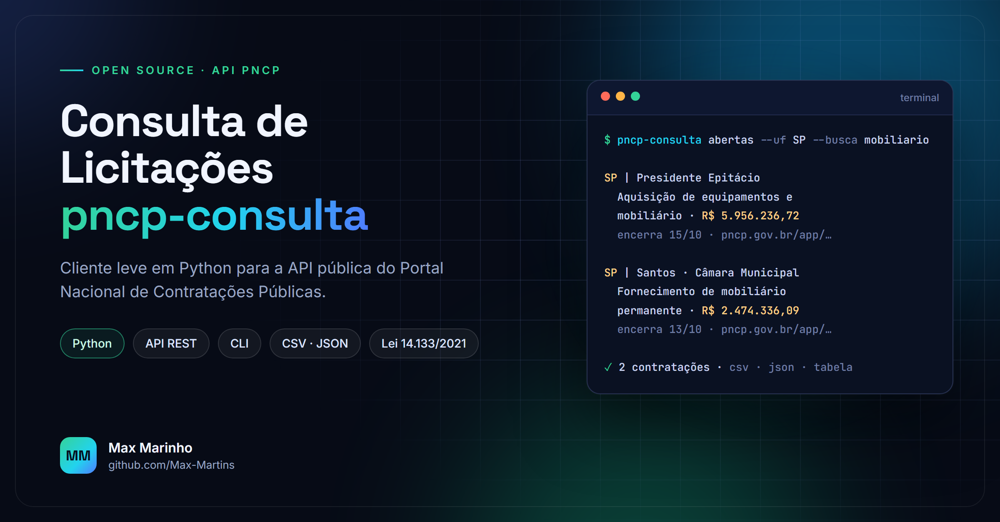

<div align="center">



[](https://github.com/Max-Martins/pncp-consulta/actions/workflows/testes.yml)


</div>

Cliente leve em Python para a **API pública de consulta do [PNCP](https://pncp.gov.br)**, o Portal Nacional de Contratações Públicas criado pela Lei nº 14.133/2021.

Consulte licitações com propostas abertas, contratações publicadas, itens e documentos de editais, direto do terminal ou do seu código, sem instalar nenhuma dependência.

## Por que usar

- **Zero dependências:** apenas a biblioteca padrão do Python.
- **Paginação automática:** percorre todas as páginas da API (limite de 50 registros por página).
- **Resiliente:** novas tentativas com espera progressiva em falhas temporárias e erro claro em parâmetros inválidos.
- **Pronto para planilha:** exporta CSV com `;` e vírgula decimal, que abre direto no Excel em português.
- **Testado:** suíte de testes sem acesso à rede, executada no GitHub Actions em Python 3.10 a 3.13.

## Instalação

Com o Python 3.10 ou superior instalado:

```bash
pip install https://github.com/Max-Martins/pncp-consulta/archive/refs/heads/main.zip
```

Não precisa ter o Git instalado. Depois disso, o comando `pncp-consulta` fica disponível no terminal.

Ou, sem instalar, dentro da pasta do projeto: `python -m pncp_consulta ...`

## Linha de comando

```bash
# Pregões eletrônicos com proposta aberta em SP nos próximos 30 dias
pncp-consulta abertas --uf SP

# Filtrar pelo objeto (ignora acentos) e salvar em planilha
pncp-consulta abertas --uf MG --busca mobiliario cadeira --formato csv -o oportunidades.csv

# Dispensas publicadas em um período
pncp-consulta publicadas --de 2026-10-01 --ate 2026-10-03 --modalidade 8 --formato json

# Detalhe, itens e documentos de uma contratação
pncp-consulta detalhe 45132495000140-1-000942/2024

# Códigos de modalidade
pncp-consulta modalidades
```

## Como biblioteca

```python
from datetime import date
from pncp_consulta import PNCPClient, IdCompra

pncp = PNCPClient()

for c in pncp.contratacoes_com_proposta_aberta(date(2026, 10, 31), modalidade=6, uf="SP", limite=20):
    print(c["numeroControlePNCP"], c["objetoCompra"])

compra = IdCompra.de_numero_controle("45132495000140-1-000942/2024")
itens = pncp.itens(compra)
documentos = pncp.arquivos(compra)  # edital, termo de referência, anexos
```

| Método | Endpoint |
|---|---|
| `contratacoes_com_proposta_aberta()` | `GET /v1/contratacoes/proposta` |
| `contratacoes_publicadas()` | `GET /v1/contratacoes/publicacao` |
| `compra()` | `GET /v1/orgaos/{cnpj}/compras/{ano}/{sequencial}` |
| `itens()` | `GET /pncp/v1/orgaos/{cnpj}/compras/{ano}/{sequencial}/itens` |
| `arquivos()` | `GET /pncp/v1/orgaos/{cnpj}/compras/{ano}/{sequencial}/arquivos` |

## Testes

```bash
python -m unittest discover -s tests -v
```

## Aviso

Projeto independente, sem vínculo com o governo federal. Os dados vêm da API pública do PNCP e podem sofrer atrasos ou instabilidades da fonte. Antes de decidir participar de uma licitação, confira sempre o edital no portal de origem.

---

<sub>Feito por [Max Marinho](https://www.linkedin.com/in/maxx-marinho/) · Licença MIT</sub>
